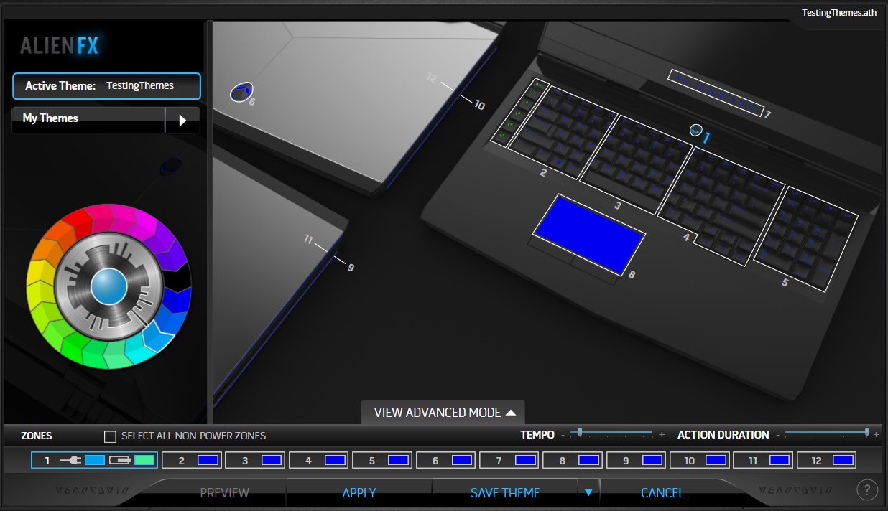

# AlienFXCaptures
## Intro
Fellow linux-using Alienware enthusiasts:  
This repo contains packet captures from the AlienFX program to the AlienFX board on a 2016 Alienware 17 R4.

You might want to know these if you use Linux exclusively, and so can't use the Dell-provided AlienFX SDK to speak with the lights on your Alienware computer.

This repo is **not** a way to change the lights on your Alienware PC.  
Those are repos like [alienfx](https://github.com/trackmastersteve/alienfx), [AlienFxLite](https://github.com/bchretien/AlienFxLite), and [alienware-kbl](https://github.com/rsm-gh/alienware-kbl).  
This repo is just packet captures between AlienFX and an Alienware 2016 17 R4.

## Reading .pcap Files
These packet capture files were generated using [USBPcap](http://desowin.org/usbpcap/) for Windows.  
They are inteded to be opened in [Wireshark](https://www.wireshark.org/), which is a free, open-source packet analyzer available for [Windows and Mac](https://www.wireshark.org/#download), and for Linux as well (but consult your distribution for how to get it).

## Capture Methodology
### Preliminary Notes
* My zone8 (touchpad) wasn't lighting up for any of these captures, so I hope (and assume) that the commands got sent correctly.
* I'm calling the left media buttons zonex, since these aren't numbered for some reason.  
zonex has options for Set 1, Set 2, and Set 3.  I didn't notice any changes for Sets 2 and 3, so in every packet collection here, I'm only changing Set 1.
### Red, Green, Blue Themes
R-G-B.pcap captures the application, to all non-power zones, of a red theme, a green theme, then a blue theme.

### Zone Morph
Each zone[#]color.pcap captures a set progression:  
solid color - red  
solid color - green  
solid color - blue

**Note** that for zone1, the progression is r-b, g-b, b-b, b-r, b-g, with an "Apply" in between each, since the colors don't change without applying the theme.  
Probably relatedly, zone1color is a much larger file than are all other zone color captures.

### Zone Morph
Each zone[#]morph.pcap captures the following morphs:  
red-black  
green-black  
blue-black  
black-black  
black-red  
black-green  
black-blue  

**Note** that zonex can't morph, and so there is no zonexmorph.pcap  
**Note** that zone1 can't morph, and so there is no zone1morph.pcap

### Zone Pulse
Each zone[#]pulse.pcap captures the application of a blue pulse, with a tempo starting at 0.1s, increasing to 1.0s by 0.1s steps, then decreasing back to 0.1s in 0.1s steps.

**Note** that zonex can't pulse, and so there is no zonexpulse.pcap  
**Note** that zone1 can't pulse, and so there is no zone1pulse.pcap

